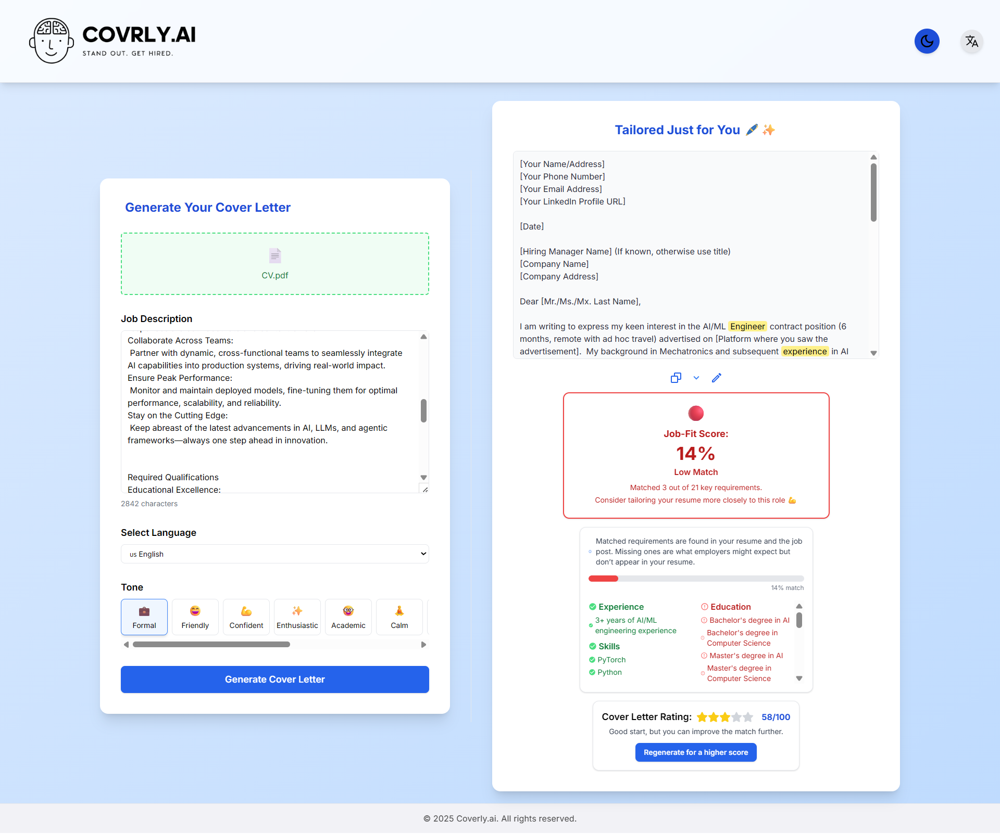

# Coverly.ai

Coverly.ai is a modern web application that helps you create tailored, professional cover letters in seconds. Just upload your resume, paste a job description, select your preferred tone and language, and let AI do the rest!


## Features

- **PDF or Image Resume Upload:** Securely upload your resume in PDF or image format (JPG, PNG, JPEG).
- **Job Description Input:** Paste the job description for the position you want to apply for.
- **Multiple Tones & Languages:** Choose from various professional tones or define your own. Supports English, French, and Arabic.
- **AI-Powered Cover Letter Generation:** Instantly generate a personalized cover letter based on your resume and the job description.
- **Job-Fit Score:** See how well your resume matches the job requirements, with a detailed breakdown of matched and missing keywords/requirements.
- **Edit & Regenerate:** Edit the generated letter and regenerate improved versions.
- **Modern UI:** Responsive, accessible, and visually appealing interface with dark mode support.

## Tech Stack

- **Frontend:** React, Tailwind CSS, React Icons, React Hot Toast
- **Backend:** Python, Flask, PyPDF2, Pillow, pytesseract, Google Gemini API
- **Other:** CORS, REST API

## Getting Started

### Prerequisites

- Node.js & npm
- Python 3.x
- [Google Gemini API Key](https://ai.google.dev/)
- [Tesseract OCR](https://github.com/tesseract-ocr/tesseract) (for image CV support)

### Installation

#### 1. Clone the repository

```bash
git clone https://github.com/yourusername/coverly.ai.git
cd coverly.ai
```

#### 2. Backend Setup

```bash
cd backend
python -m venv venv
# On Windows:
venv\Scripts\activate
# On Mac/Linux:
# source venv/bin/activate
pip install -r requirements.txt
# Create a .env file and add your Google Gemini API key:
# GENAI_API_KEY=your_actual_api_key_here
python app.py
```

#### 3. Frontend Setup

```bash
cd ../frontend
npm install
npm start
```

- The frontend will run on [http://localhost:3000](http://localhost:3000)
- The backend will run on [http://localhost:5000](http://localhost:5000)

## Usage

1. Upload your CV (PDF or Image).
2. Paste the job description.
3. Select your preferred tone and language.
4. Click **Generate Cover Letter**.
5. Review, edit, or regenerate as needed.
6. Copy your tailored cover letter and apply with confidence!

## Screenshots



## License

MIT License

---

© 2025 MeriemSakka. All rights reserved.
